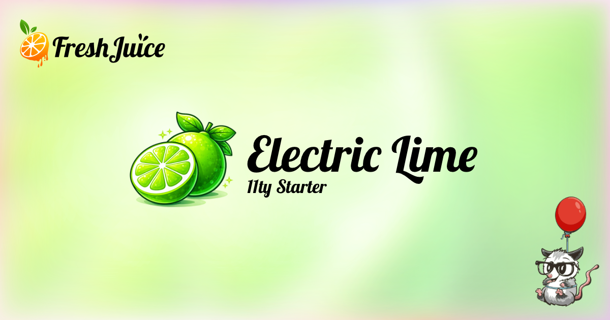

# Electric Lime 11ty Starter



A vibrant, fast, and accessible starter theme for building static websites with [Eleventy](https://www.11ty.dev/), [TailwindCSS v4](https://tailwindcss.com/), and [Alpine.js](https://alpinejs.dev/).

**[Live Demo](https://electric-lime-starter.freshjuice.dev)**

## Features

- **Eleventy v3** - Fast static site generation with ES modules
- **TailwindCSS v4** - Utility-first CSS framework
- **Alpine.js** - Lightweight JavaScript for interactivity
- **Pagefind** - Static search with zero configuration
- **Shiki** - Beautiful syntax highlighting for code blocks
- **eleventy-img** - Automatic image optimization (AVIF, WebP, JPEG)
- **Phosphor Icons** - 6,000+ icons with multiple weights
- **Speculation Rules** - Instant page loads with prefetching
- **Accessibility** - WCAG 2.1 AA compliant with automated testing
- **SEO Ready** - Sitemap, RSS feed, meta tags, Open Graph
- **LLM Ready** - llms.txt and llms-full.txt for AI assistants

## Quick Start

### Prerequisites

- Node.js 24 or higher (see `.nvmrc`)
- npm

### Installation

```bash
# Clone the repository
git clone https://github.com/freshjuice-dev/electric-lime-11ty-starter.git
cd electric-lime-11ty-starter

# Install dependencies
npm install

# Start development server
npm run dev
```

Open http://localhost:8080 to view your site.

### Available Scripts

| Command | Description |
|---------|-------------|
| `npm run dev` | Start development server with hot reload |
| `npm run build` | Build for production |
| `npm run clean` | Remove `_site` folder |

## Project Structure

```
electric-lime-11ty-starter/
├── src/
│   ├── _data/                 # Global data files
│   │   ├── build.js           # Build info (git hash, timestamp)
│   │   ├── metadata.yaml      # Site metadata
│   │   ├── header.yaml        # Navigation config
│   │   ├── footer.yaml        # Footer configuration
│   │   └── socials.yaml       # Social media links
│   ├── _includes/
│   │   ├── layouts/           # Page layouts
│   │   │   ├── base.njk       # Base HTML layout
│   │   │   ├── page.njk       # Standard page layout
│   │   │   ├── post.njk       # Blog post layout
│   │   │   ├── author.njk     # Author page layout
│   │   │   ├── legal.njk      # Legal pages layout
│   │   │   └── error.njk      # Error pages layout
│   │   ├── partials/          # Reusable partials
│   │   │   ├── header.njk
│   │   │   ├── footer.njk
│   │   │   └── metatags.njk
│   │   └── _components/       # Nunjucks component macros
│   │       └── index.njk
│   ├── assets/
│   │   ├── css/
│   │   │   ├── main.css       # Entry point
│   │   │   ├── _base.css      # CSS variables, reset
│   │   │   ├── _typography.css
│   │   │   ├── _buttons.css
│   │   │   ├── _forms.css
│   │   │   ├── _utilities.css
│   │   │   ├── _pagefind.css
│   │   │   ├── _youtube.css
│   │   │   └── _high-contrast.css
│   │   └── js/
│   │       ├── main.js
│   │       └── components/
│   │           └── contrast-toggle.js
│   ├── authors/               # Author profiles
│   ├── blog/                  # Blog posts
│   ├── legal/                 # Legal pages
│   ├── pages/                 # Site pages
│   └── static/                # Static files (favicons, etc.)
├── config/                    # Eleventy configuration
│   ├── collections.js
│   ├── filters.js
│   ├── shortcodes.js
│   ├── transforms.js
│   └── plugins.js
└── eleventy.config.js
```

## Components

Import and use Nunjucks macros in your templates:

```nunjucks


{# Buttons #}
{{ button({ text: "Get Started", url: "/contact/", variant: "primary" }) }}
{{ button({ text: "Learn More", variant: "secondary" }) }}
{{ button({ text: "Cancel", variant: "outline" }) }}

{# Cards #}
{{ card({
  title: "Post Title",
  description: "Description text",
  image: "/assets/images/photo.jpg",
  url: "/blog/post/",
  date: page.date,
  author: "john-doe"
}) }}

{# Badges #}
{{ badge({ text: "New", variant: "primary" }) }}
```

### Button Variants

| Class             | Description             |
|-------------------|-------------------------|
| `.btn`            | Primary lime button     |
| `.btn--secondary` | Light background        |
| `.btn--outline`   | Transparent with border |
| `.btn--ghost`     | No background or border |

Sizes: `.btn--sm`, `.btn--md`, `.btn--lg`

## Shortcodes

### YouTube Embeds

```nunjucks

```

Uses lite-youtube-embed for fast, privacy-friendly embeds (youtube-nocookie.com).

### Current Year

```nunjucks

```

## Configuration

### Site Metadata

Edit `src/_data/metadata.yaml`:

```yaml
title: "Your Site Name"
description: "Your site description for SEO"
url: "https://yoursite.com"
language: "en"
author: "Your Name"
email: "hello@example.com"
twitter: "@yourhandle"
image: "/assets/images/og-image.png"
themeColor: "#65a30d"
```

### Navigation

Edit `src/_data/header.yaml`:

```yaml
navigation:
  - label: "Home"
    url: "/"
  - label: "About"
    url: "/about/"
  - label: "Blog"
    url: "/blog/"
```

### Footer

Edit `src/_data/footer.yaml` to configure footer columns and links.

## Search

Pagefind provides instant static search. It runs automatically after build and indexes all pages.

The search UI is at `/search/`.

## Generated Files

| File             | Description                           |
|------------------|---------------------------------------|
| `/sitemap.xml`   | XML sitemap for search engines        |
| `/sitemap.xsl`   | Visual sitemap stylesheet             |
| `/robots.txt`    | Robots directives                     |
| `/feed.xml`      | RSS feed for blog posts               |
| `/llms.txt`      | LLM-friendly site index               |
| `/llms-full.txt` | Full content export for LLMs          |
| `/_headers`      | Security headers (Netlify/Cloudflare) |
| `/_redirects`    | Redirect rules (Netlify/Cloudflare)   |

## Front Matter Options

```yaml
---
title: "Page Title"
description: "Page description for SEO"
image: "/assets/images/og-image.jpg"
noindex: true              # Exclude from sitemap
llms_exclude: true         # Exclude from llms.txt
---
```

## Image Credits

Demo images are royalty-free from [Pexels](https://www.pexels.com/):

| Image              | Photographer         | Link                                                                                      |
|--------------------|----------------------|-------------------------------------------------------------------------------------------|
| Author: Jane Smith | Daniel Xavier        | [View](https://www.pexels.com/photo/portrait-photo-of-woman-718978/)                      |
| Author: John Doe   | Andrea Piacquadio    | [View](https://www.pexels.com/photo/photo-of-a-man-listening-music-on-his-phone-846741/)  |
| Lime/Citrus        | Juan Salamanca       | [View](https://www.pexels.com/photo/riped-banana-61127/)                                  |
| Strawberries       | Susanne Jutzeler     | [View](https://www.pexels.com/photo/bowl-of-strawberry-fruits-2820144/)                   |
| Orange             | Pixabay              | [View](https://www.pexels.com/photo/orange-fruite-51958/)                                 |
| Raspberries        | Pixabay              | [View](https://www.pexels.com/photo/red-raspberry-52536/)                                 |
| Pineapples         | Pineapple Supply Co. | [View](https://www.pexels.com/photo/two-pineapple-fruit-on-sad-near-body-of-water-27269/) |
| Cherries           | Wendy Aros-Routman   | [View](https://www.pexels.com/photo/red-cherries-on-stainless-steel-bowl-1178610/)        |

Placeholder logos from [Logoipsum](https://logoipsum.com/).

## Contributing

Contributions are welcome! Please open an issue first to discuss what you'd like to change.

## License

MIT License - use this starter for any project.

## Credits

Built by [Alex Zappa](https://alex.zappa.dev) at [FreshJuice](https://freshjuice.dev)
